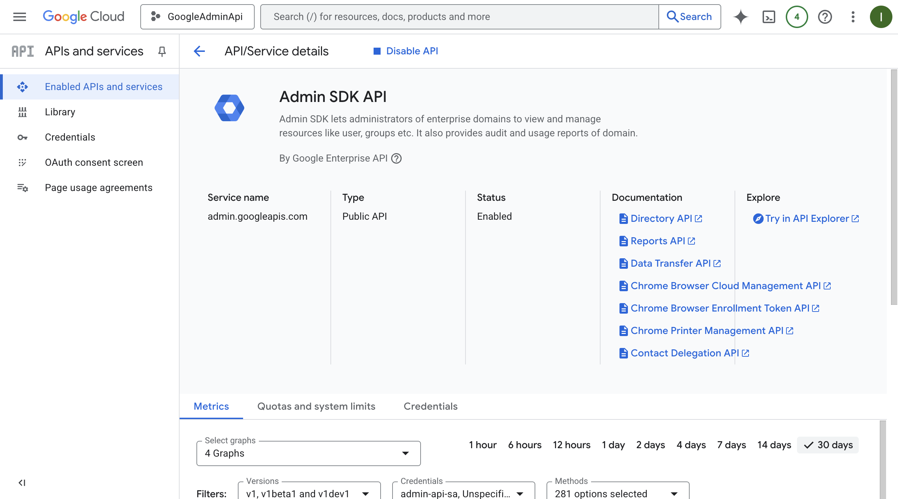
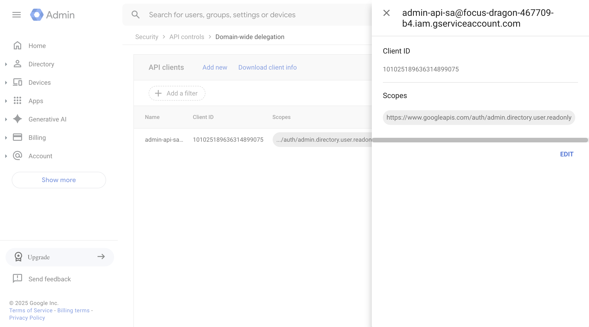
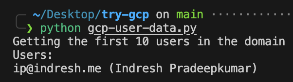

### POC: Listing Users from Admin API

This document explains the process of setting up a Google Cloud project and using the Admin SDK Directory API to retrieve a list of users. The goal is to create a Proof of Concept (POC) to understand how to pull user data from the Admin API.

#### 1\. Setup and Configuration

- **Workspace:** The project is based on the workspace for the `indresh.me` domain, which is automatically configured as a Google Cloud organization.
- **Project:** A Google Cloud project named `GoogleApiAdmin` was created.
- **Service Account:** A service account, `admin-api-sa`, was created within the project.
- **API Enablement:** The Admin SDK Directory API was enabled for the `GoogleApiAdmin` project, as shown in the screenshot below.

- **Service Account Key:** A JSON key was generated for the service account for authentication.
- **Domain-Wide Delegation (DWD):** Domain-wide delegation was configured for the `admin-api-sa` service account with the scope `https://www.googleapis.com/auth/admin.directory.user.readonly`. This allows the service account to impersonate a domain user to access their data.

#### 2\. Code Explanation

The provided Python code uses the `google-api-python-client` and `google-auth` libraries to interact with the Admin SDK Directory API.

**Main Points of the Code:**

- **Authentication:** The code uses a service account key (`sa.json`) and an impersonated super admin email (`ip@indresh.me`) to authenticate with the Admin SDK. This is done via domain-wide delegation.
- **API Service:** It builds a service object for the `admin` API (specifically `directory_v1`) to make API calls.
- **User Listing:** The code calls the `service.users().list()` method to retrieve a list of up to 10 users from the domain, identified by `customer='my_customer'`.

#### 3\. Output

